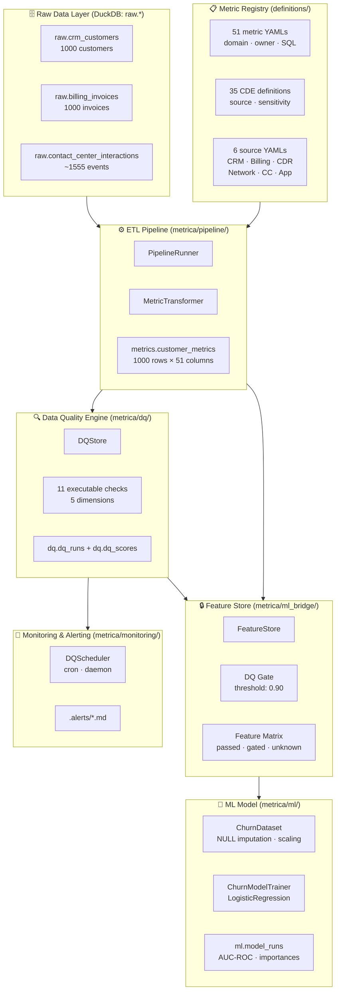
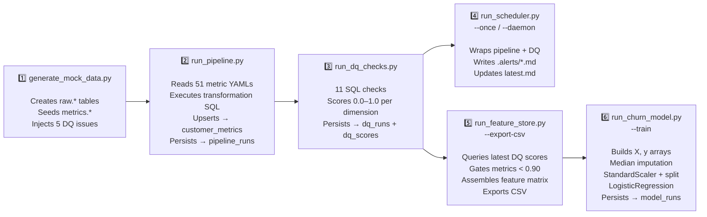
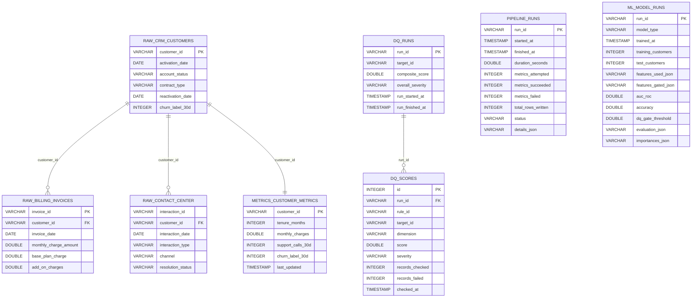
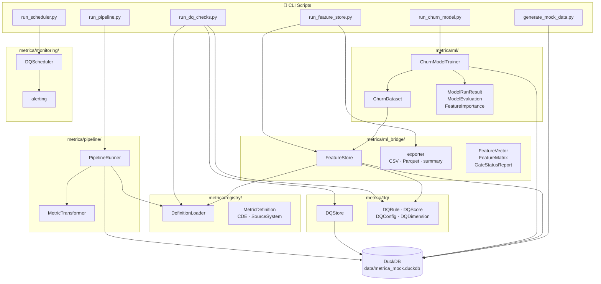

# Architecture

End-to-end data flow documentation for the Metrica metric management system.

---

## The Metrica Philosophy

Metrics are first-class citizens — every metric has a YAML definition with owner, domain, lineage, and transformation SQL, all version-controlled in Git. Data quality is a **gate**, not an afterthought: the Feature Store refuses to serve metrics that fail the 0.90 composite DQ threshold, ensuring that ML models never silently train on corrupt data. The Feature Store acts as the **ML contract** — data scientists interact with governed, quality-assured feature vectors, never raw tables.

---

## Diagram 1 — High-Level System Overview



---

## Diagram 2 — Operational Flow (Run Order)



### Run Order

```bash
# From zero to a trained churn model:
1. python3 scripts/generate_mock_data.py          # seed raw data (1000 customers, 5 DQ issues)
2. python3 scripts/run_pipeline.py                 # compute metrics (raw.* → metrics.customer_metrics)
3. python3 scripts/run_dq_checks.py                # score data quality (11 checks → dq.dq_scores)
4. python3 scripts/run_feature_store.py --gate-status                 # inspect DQ gate
5. python3 scripts/run_feature_store.py --export-csv data/features.csv  # export feature matrix
6. python3 scripts/run_churn_model.py --train      # train baseline churn model
```

---

## Diagram 3 — DuckDB Schema Map



### Schema Summary

| Schema | Tables | Purpose |
|--------|--------|---------|
| `raw.*` | crm_customers, billing_invoices, contact_center_interactions | Source data (mock or real ingestion) |
| `metrics.*` | customer_metrics, metric_catalog, cde_catalog, metric_cde_map | Computed metrics and registry catalog |
| `dq.*` | dq_runs, dq_scores | Data quality run history and per-dimension scores |
| `pipeline.*` | pipeline_runs | ETL run tracking (attempts, successes, failures) |
| `ml.*` | model_runs | Model training history, evaluation metrics, feature importances |

---

## Diagram 4 — Package Dependency Map



---

## Key Design Decisions

- **Why DuckDB (not Postgres)**: Embedded, zero-server, ARM-compatible (Termux), fast columnar analytical SQL. Perfect for append-mostly DQ scoring and metric queries. No Docker, no systemd, no JVM.

- **Why YAML definitions (not a database)**: Human-readable, git-diffable, versionable. Domain experts can review metric definitions in pull requests. The Python loader hydrates YAMLs into Pydantic models at runtime.

- **Why DQ gate before ML**: Silent data quality issues corrupt models invisibly. The Feature Store refuses to serve features below the 0.90 gate threshold, forcing data quality issues to be resolved before they reach the model.

- **Why logistic regression first (not XGBoost)**: Interpretable coefficients give direct feedback on which features matter and which DQ-gated features *would have* contributed — informing DQ prioritization. Baseline first, ensemble later.

- **Why `class_weight='balanced'`**: Mock data has ~5% churn rate. An unweighted model predicts all-0 and achieves 95% accuracy with 0% recall. Balanced weighting forces the model to actually learn the minority class.

- **Why custom DQ framework (not Great Expectations / Soda)**: ~200 lines of Python vs. heavy dependencies with JVM-adjacent ecosystems. DQ rules live alongside metric definitions in YAML. Full control, minimal footprint on ARM.

---

## Current Status

| Layer | Status | Notes |
|-------|--------|-------|
| CRM metrics (3) | ✅ Real | tenure_months, monthly_charges, support_calls_30d — fully computed from raw data |
| Churn label | ✅ Real | churn_label_30d derived from account_status (5% terminated) |
| DQ checks | ✅ Real | 11 checks across 3 metrics, 5 dimensions, persistent scores |
| CDR metrics (8) | 🔲 Placeholder | No raw CDR table in mock data — NULL values in customer_metrics |
| Network metrics (6) | 🔲 Placeholder | No network data — NULL values |
| App metrics (6) | 🔲 Placeholder | No app event data — NULL values |
| Billing extras (7) | 🔲 Placeholder | avg_overage_charges, payment_delays_count, etc. — NULL |
| Derived/Engineered (14) | 🔲 Placeholder | stickiness_score, service_distress_index, etc. — NULL |
| Churn model | ✅ Running | 3 real features + 47 NULL features. AUC improves with real CDR/Network data |
| Feature Store | ✅ Operational | DQ gate blocks 47 metrics with composite score 0.0 (no DQ checks yet) |

### Test Suite

55 tests across 7 test files, all passing:

| File | Tests | Coverage |
|------|-------|----------|
| test_definitions.py | 5 | Registry loading, validation |
| test_dq_store.py | 2 | DQ persistence, trends |
| test_feature_store.py | 12 | Gate logic, feature retrieval, export |
| test_mock_data.py | 8 | Schema, DQ issues, data counts |
| test_pipeline.py | 10 | ETL transformer, runner, idempotency |
| test_scheduler.py | 7 | Scheduler config, alerts, run modes |
| test_churn_model.py | 11 | Dataset, trainer, importances, persistence |
